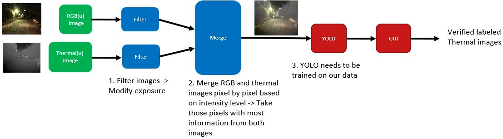

# Project SALTI
Semi-Automatic Labelling of Thermal Images

## Quick reference
* [Documentation WIKI](https://github.com/tue-mps-edu/asd-pdeng-project-2020-developer/wiki/Home) (Installation & project documentation)
* [SALTI source code](SALTI/)

## Authors
* **Abhishek Balakrishna Bhat** - *insert work done* - [Abhishek0895](https://github.com/Abhishek0895)
* **Alireza Moayyedi** - *insert work done* - [A-Moayyedi](https://github.com/A-Moayyedi)
* **Arjun Pradeep Kumar** - *insert work done* - [ArjunPradeepGit](https://github.com/ArjunPradeepGit)
* **Arsel Hasan** - *insert work done* - [arselhasan](https://github.com/arselhasan)
* **Berend van den Berg** - *insert work done* - [vdBerg93](https://github.com/vdBerg93)
* **Kunal Iyer** - *insert work done* - [KunalASD](https://github.com/KunalASD)
* **Markos Papadimitriou** - *insert work done* - [Markos0896](https://github.com/Markos0896)
* **Yash Khetan** - *insert work done* - [yashkhetan1994](https://github.com/yashkhetan1994)

## Acknowledgements
* **Pavol Jancura** - * insert ack *
